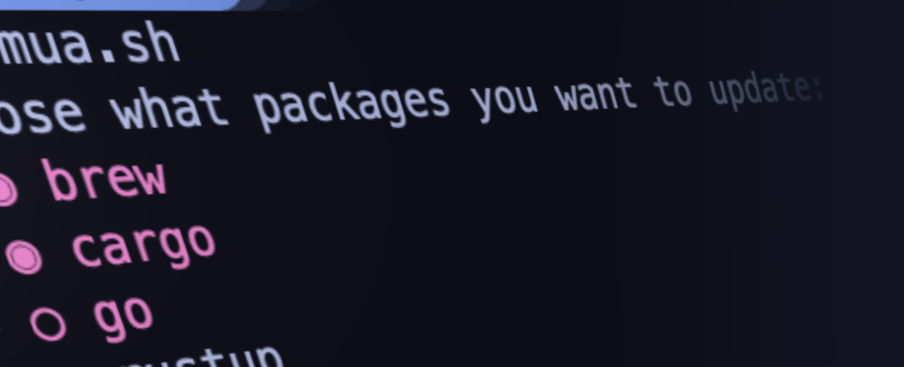

# Markus Updates All

Update all installed packages and binaries with a single tool.

Built with [gum](https://github.com/charmbracelet/gum).

## Usage:

    ./mua

Update everything:

    ./mua --all

### Currently supported:

* **asdf** plugins *and* tools
* **Go** binaries via `go-global-update`
* **Homebrew** formulae via `brew`
* **Rust** binaries via `cargo install-update`
* **Rust** toolchain via `rustup`

